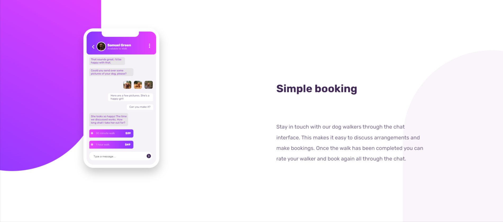

# Frontend Mentor - Chat app CSS illustration solution

This is a solution to the [Chat app CSS illustration challenge on Frontend Mentor](https://www.frontendmentor.io/challenges/chat-app-css-illustration-O5auMkFqY). Frontend Mentor challenges help you improve your coding skills by building realistic projects. 

## Table of contents

- [Overview](https://github.com/Abubakar-Tamboli/OrderSummaryComponent)
  - [The challenge](https://www.frontendmentor.io/challenges/chat-app-css-illustration-O5auMkFqY)
  - [Links](https://github.com/Abubakar-Tamboli/OrderSummaryComponent)
- [Author](https://github.com/Abubakar-Tamboli)

## Overview

### The challenge

Users should be able to:

- View the optimal layout for the component depending on their device's screen size
- **Bonus**: See the chat interface animate on the initial load

### Screenshot

### Links

- Solution URL: (https://github.com/Abubakar-Tamboli/chat-app-illustration-by-abu)
- Live Site URL: (https://abubakar-tamboli.github.io/chat-app-illustration-by-abu/)

## My process

### Built with

- Semantic HTML5 markup
- CSS custom properties
- Flexbox

## Author

- Website - [Abubakar Yamboli](https://github.com/Abubakar-Tamboli)
- Frontend Mentor - [@Abubakar-Tamboli](https://www.frontendmentor.io/profile/Abubakar-Tamboli)

